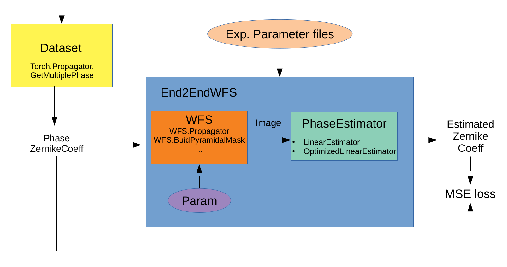

This code is for the end-to-end design of a WFS along with a neural network.

Requirements :

- aotools 
- mmengine
- torch
- random

- params_exp : file containing the experimental parameters for atmosphere, loop, WFS and training
- PhaseDataset : function to create the dataset according to the exp. parameters
- Propagator.py : original code from Franscisco
- TorchPropagator.py : translation to torch of the numpy functions
- Train.py : training of the end2end pipeline

Missing :

- check the transcription from numpy to torch

Done :
- fix bug on parameters optimization
- saving the network and optimized parameters after training
- put batch of images at the network input 
- make the noise differentiable (reparametrization trick ?) 

Newt step :

- Francisco : run the code :)
- Francisco & Benoît : prepare toy examples for optimization with known results to check the training
- Pauline : make a new branch to fix the OptimizedLinearEstimator
